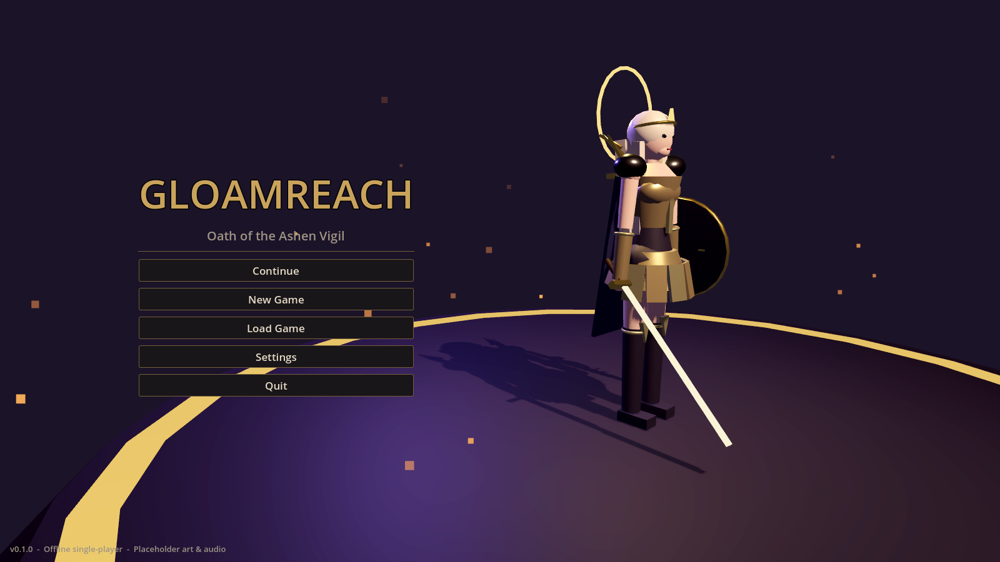
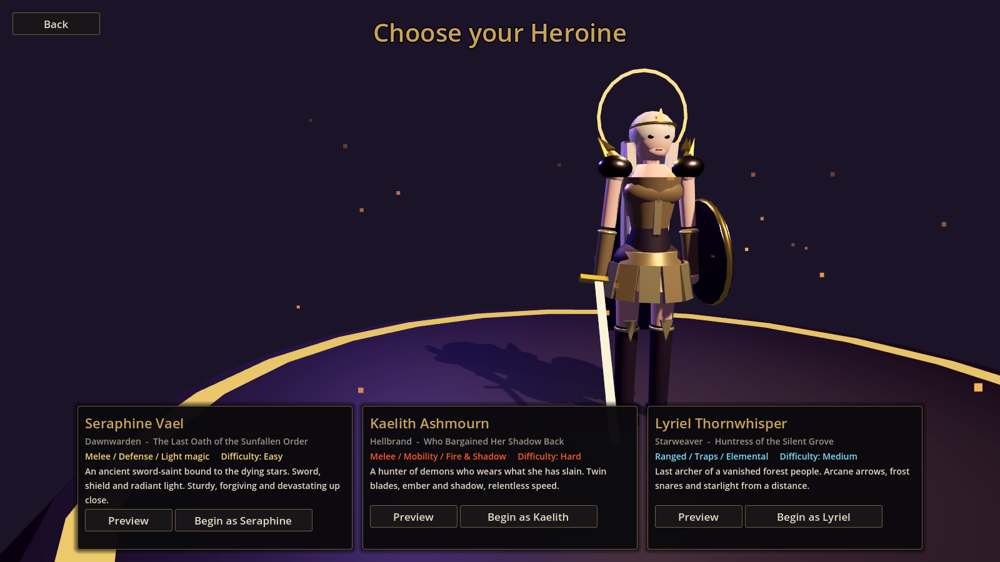
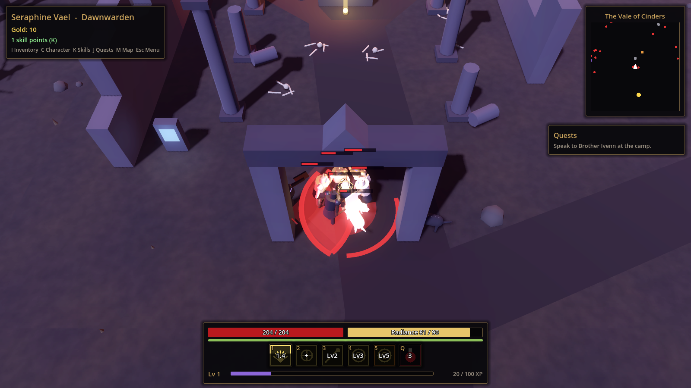
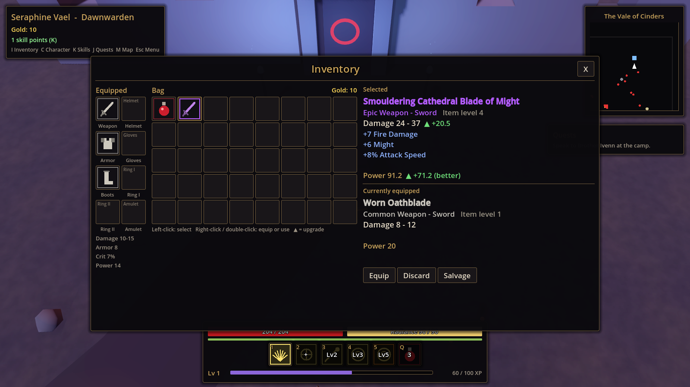
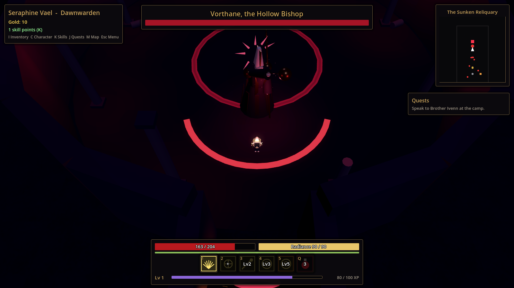

# Gloamreach — Oath of the Ashen Vigil

*Working title.* An original, **offline, single-player dark-fantasy action RPG** built with **Godot 4.3** and GDScript. Explore a burned valley, fight the Hollowed, loot procedurally generated gear, level up, unlock skills, descend into the Sunken Reliquary and defeat Vorthane, the Hollow Bishop.

> Status: **vertical slice playable and verified** — 24/25 acceptance tests PASS, 1 BLOCKED (GPU performance on real mid-range hardware not measured yet), 42/42 unit tests PASS. All art and audio are **procedural placeholders**. See [PROJECT_STATUS.md](PROJECT_STATUS.md) and [TEST_REPORT.md](TEST_REPORT.md).



## What is in the vertical slice

- **3 playable heroines** with distinct kits and silhouettes (data-driven, 5 active + 2 passive skills each):
  - **Seraphine Vael — Dawnwarden** (flagship): sword, shield, block, celestial light magic.
  - **Kaelith Ashmourn — Hellbrand**: twin blades, fire and shadow, high mobility.
  - **Lyriel Thornwhisper — Starweaver**: bow, arcane arrows, frost traps, starfall.
- **Responsive combat**: basic + heavy attacks, dodge with i-frames, block, skills with cooldowns and resource costs, crits, damage numbers, hit flash, knockback, burn / chill / stun, AoE, projectiles, telegraphed enemy attacks.
- **5 enemy archetypes** (corrupted warrior, beast, ranged caster, assassin, heavy) with a detect → chase → telegraph → attack → recover AI, pack aggro and leashing.
- **Boss**: Vorthane, the Hollow Bishop — cone sweeps, projectile fans, delayed grave pillars, phase 2 enrage with summons and a ring nova, unique class loot.
- **RPG systems**: XP and levels, attributes, skill points and ranks, 7 equipment slots (+2 rings), 5 rarities, procedural affixes, legendary uniques, item comparison, stacking inventory, salvage and potion crafting, merchant.
- **World**: the Vale of Cinders (camp, ruined chapel, corrupted forest, cultist camp, Shrine of the Broken Saint, sealed Reliquary gate), the Sunken Reliquary dungeon and boss arena, readable lore, chests, minimap and full map.
- **Quests**: data-driven quest chain with kill / collect / explore / interact / boss objectives, branching NPC dialogue.
- **Local saves**: manual save, autosave (zone change, quest completion, boss, every 2 min) and load. No account, login, server or network code.

## Controls (mouse first, like classic ARPGs — keyboard also works)

| Action | Mouse | Keyboard |
|---|---|---|
| Walk | Left-click / hold on the ground | W A S D |
| Attack an enemy (walks into range, keeps attacking) | Left-click the enemy | — |
| Talk to NPC / open chest / use door | Left-click it | E when close |
| Pick up loot | Left-click it (or walk over it) | walk over it |
| Heavy attack toward the cursor | Right-click | — |
| Skills | Click the skill icons | 1 – 5 |
| Health potion | Click the potion icon | Q |
| Dodge | — | Space |
| Block (Dawnwarden) | — | Shift (hold) |
| Bag / Hero / Skills / Quests / Map / Menu | Buttons bottom-left | I / C / K / J / M / Esc |
| Zoom | Mouse wheel | — |
| Quick save | — | F5 |

Gamepad bindings for movement, attacks, dodge, interact, potion and pause are already registered (see `systems/core/input_setup.gd`).

## Running it

1. Install **Godot 4.3** (standard build): <https://godotengine.org/download/archive/4.3-stable/>
2. Open `project.godot` in Godot and press **F5**, or run `godot --path .` from the repository root.

Windows build, Linux build and test commands are in [BUILD_INSTRUCTIONS.md](BUILD_INSTRUCTIONS.md).

## Tests

```bash
tools/run_acceptance.sh      # everything: parse check, unit tests, 2-process playthrough (offline), class smoke test, benchmark, TEST_REPORT.md
godot --headless res://systems/tests/test_runner.tscn   # unit tests only
```

The acceptance run plays the whole vertical slice with an automated player (`systems/tests/acceptance/acceptance_bot.gd`), quits, relaunches the game in a **new process**, loads the save and keeps playing — inside a network namespace with no network.

## Repository layout

```
project.godot          Godot project (autoloads, display, physics)
data/                  all content: classes, skills, items, enemies, quests, NPC dialogue (JSON)
systems/               engine-agnostic rules: core autoloads, combat math, inventory, loot,
                       progression, quests, crafting, save, audio, tests
game/                  scenes & nodes: player, enemies, boss, skills, items, maps, NPCs, UI
docs/screenshots/      captures from the automated screenshot tour
tools/                 check.sh, run_acceptance.sh, make_test_report.py
```

Architecture details: [ARCHITECTURE.md](ARCHITECTURE.md). Design: [GAME_DESIGN.md](GAME_DESIGN.md). Art direction and placeholder list: [ART_DIRECTION.md](ART_DIRECTION.md). Plan: [ROADMAP.md](ROADMAP.md).

## Screenshots (placeholder art, software renderer)

| | |
|---|---|
|  |  |
|  |  |

## License

Proprietary — see [LICENSE.md](LICENSE.md). Built with the Godot Engine (MIT).
